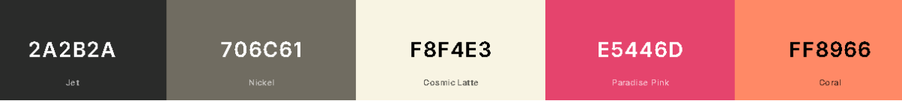

# Marvin

Marvin is a **Google Web Assistant** aimed to help **Students** review for their next Examination. Marvin has a build in **Questionnaire Generator** and **Speech Recognition** for more Interactive learning and get you to speed with on practicing on your next **Quizzes / Examination.** 

---

### Slogan: ***“No more lonely study session”.***

---

### Origin:

        When the world is at risk, and each and everyone needs to be safe, the Academic Institution adopt to a newly type of learning. **“Online learning”** is the future of learning. 

However, for many, learning online and alone was been very tough especially for someone who is used to communicating and expressing their thoughts all throughout the subject.

“**Marvin**” the name of my closest friend and my so called “**Learning Buddy**” has been interpreted into a web learning platform where everyone / anyone can review / recite and practice for their next quizzes / examination.

### Mission:

        Our goal was to make Online Learning as **Fun** and **Intuitive** as possible, by providing Interactive quizzes that can sharpen one’s written and communicating ability.

### App Theme: *“Sticky Notes”.*

### Color Palette:



# Technologies

---

- [**Node.js ^16.14.2**](https://nodejs.org/en/)
- [**Redis ^6.2**](https://redis.io/download/)
- **[MySQL ^8.0](https://www.mysql.com)**

# Packages

---

- [**Express.js ^4.17.3**](https://www.npmjs.com/package/express)
- [**Socket.io ^4.5.0**](https://www.npmjs.com/package/socket.io)

# Entity Relationship Diagram

---


# Features

---

### Login and Registration


---

### Voice Commands


---

### Questionnaire Generator


---

### Recent Scores


---

### Share Subject


---

### Chat box


# Setup Guide

---

### Step 1

- **Download** or **Clone** The Repository
- **Extract** if necessary

### Step 2

- **Download & Install Tools**
    - [**Text Editor [VSCode]**](https://code.visualstudio.com/download)
    - [**MySQL Workbench**](https://dev.mysql.com/downloads/workbench/)
    - [**Redis**](https://redis.io/download/)
    - [**Node.js**](https://nodejs.org/en/)

### Step 3

- **Locate** the **“marvin.sql”** inside the app folder.
- **Open** the file inside the **MySQL Workbench** and **Run**.

### Step 4

- **Open** and **Run** the **Redis server** on the **shell / wsl** **terminal**.

```bash
redis-server
```

- **NOTE:** if you use windows 10 for this, you will not be able to use linux command to use redis. instead learn on how to create a **Windows Subsystem for Linux(WSL)** [**here](https://docs.microsoft.com/en-us/windows/wsl/install).**

### Step 5

- **Open** and **Run** the **Node.js** app server on **another terminal**.

```bash
nodemon app.js
```

### Step 6

- **Open web browser** of your choice and type this **URL** in your **address bar**

```
localhost:8888
```

### Step 7

- **Congratulations**!, you have successfully cloned Marvin.

### **Note:**

- Some problem’s may occur, depending on System’s Configuration.
- If Encountered any problem feel free to dive the web.

# Contributors

---

**Arjhay Camba Frias  ***| *** prehacks0942*@gmail.com* |  [https://www.linkedin.com/in/arjhay-frias/](https://www.linkedin.com/in/arjhay-frias/)**